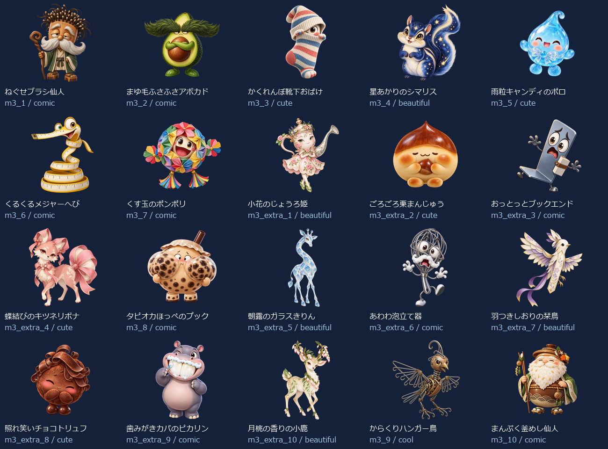
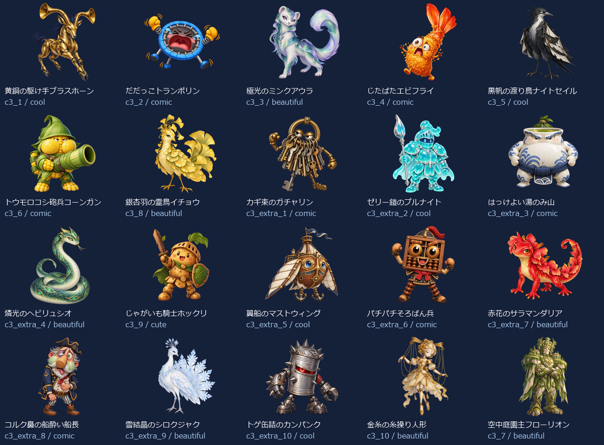
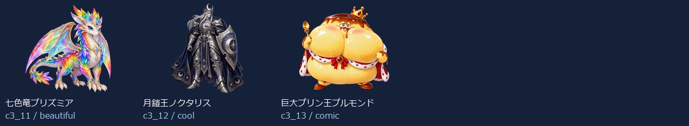

# Eiken3 Level 3：新名称・新画像43体（2026-10-05）

- 練習20＋バトル23（裏ボス3を含む）＝43キャラ。出題方法で倍に数えていません。
- 新しい名称に合わせてbuilt-in image_genで各キャラを個別制作。以前の4級以降の画像を改名して使っていません。
- 同じprofileから級＋既存IDで名前・タイプ・色・台詞・画像を取得。図鑑・トップ・戦闘・勝利・拡大へ反映。
- 既存ID・HP・登場順・撃破保存キーを維持。5級の名簿と画像は維持。
- 目・表情・体形・素材・画風を分散。最新指示の約4体に1体の大きく笑えるデザインを重点枠として制作。笑えるかどうかには個人差があります。

## 画像と読み込み

- 256px：43枚合計767.7KiB、平均17.9KiB。
- 384px：43枚合計1365.4KiB、平均31.8KiB。
- 1024px：43枚合計6643.9KiB、平均154.5KiB。
- 静止透過WebP、元画像を拡大せず変換。図鑑は遅延取得、戦闘は次の敵だけ先読み、高解像度は拡大した1体だけ取得。追加ライブラリなし。
- 旧画像を保全する別URLフォルダを使用し、古い画像キャッシュとの混同を防止。

## 修正一覧

| 区域・順 | ID | 旧名称 | 新名称 | デザインの方向 |
| --- | --- | --- | --- | --- |
| 練習 1 | m3_1 | 言い訳ゴースト | ねぐせブラシ仙人 | コミカル |
| 練習 2 | m3_2 | よそみロボ | まゆ毛ふさふさアボカド | コミカル |
| 練習 3 | m3_3 | 夜更かしフクロウ | かくれんぼ靴下おばけ | かわいい |
| 練習 4 | m3_4 | 廊下ダッシュチーター | 星あかりのシマリス | きれい |
| 練習 5 | m3_5 | なまけゴーレム | 雨粒キャンディのポロ | かわいい |
| 練習 6 | m3_6 | 偏食モンスター | くるくるメジャーへび | コミカル |
| 練習 7 | m3_7 | 迷路マンション | くす玉のポンポリ | コミカル |
| 練習 8 | m3_extra_1 | 正直ゴースト | 小花のじょうろ姫 | きれい |
| 練習 9 | m3_extra_2 | 集中ロボ改 | ごろごろ栗まんじゅう | かわいい |
| 練習 10 | m3_extra_3 | 早寝フクロウ | おっとっとブックエンド | コミカル |
| 練習 11 | m3_extra_4 | 廊下ストッパー | 蝶結びのキツネリボナ | かわいい |
| 練習 12 | m3_8 | 雷おやじ | タピオカほっぺのプック | コミカル |
| 練習 13 | m3_extra_5 | 運動ゴーレム | 朝露のガラスきりん | きれい |
| 練習 14 | m3_extra_6 | 野菜スライム | あわわ泡立て器 | コミカル |
| 練習 15 | m3_extra_7 | 出口案内ミミック | 羽つきしおりの栞鳥 | きれい |
| 練習 16 | m3_extra_8 | 雷雲ゴースト | 照れ笑いチョコトリュフ | かわいい |
| 練習 17 | m3_extra_9 | 宿題衛星コア | 歯みがきカバのピカリン | コミカル |
| 練習 18 | m3_extra_10 | 提出日ガーディアン | 月桃の香りの小鹿 | きれい |
| 練習 19 | m3_9 | 宿題ブラックホール | からくりハンガー鳥 | かっこいい |
| 練習 20 | m3_10 | 夏休みの宿題王 | まんぷく釜めし仙人 | コミカル |
| バトル 1 | c3_1 | カオススライム | 黄銅の駆け手ブラスホーン | かっこいい |
| バトル 2 | c3_2 | キメラビースト | だだっこトランポリン | コミカル |
| バトル 3 | c3_3 | ヴォイドウィング | 極光のミンクアウラ | きれい |
| バトル 4 | c3_4 | スペクターロード | じたばたエビフライ | コミカル |
| バトル 5 | c3_5 | 機神タイタン | 黒帆の渡り鳥ナイトセイル | かっこいい |
| バトル 6 | c3_6 | アビス・ウォーカー | トウモロコシ砲兵コーンガン | コミカル |
| バトル 7 | c3_8 | 断罪のセラフ | 銀杏羽の霊鳥イチョウ | きれい |
| バトル 8 | c3_extra_1 | 混沌スライム改 | カギ束のガチャリン | コミカル |
| バトル 9 | c3_extra_2 | 金角キメラ | ゼリー鎧のプルナイト | かっこいい |
| バトル 10 | c3_extra_3 | 夜空ウィング | はっけよい湯のみ山 | コミカル |
| バトル 11 | c3_extra_4 | 白影ロード | 燐光のヘビリュシオ | きれい |
| バトル 12 | c3_9 | 虚無のコロッサス | じゃがいも騎士ホックリ | かわいい |
| バトル 13 | c3_extra_5 | 機神ガード | 翼船のマストウィング | かっこいい |
| バトル 14 | c3_extra_6 | 深淵ウォーカー改 | パチパチそろばん兵 | コミカル |
| バトル 15 | c3_extra_7 | 裁きの羽 | 赤花のサラマンダリア | きれい |
| バトル 16 | c3_extra_8 | 虚無巨像の影 | コルク鼻の船酔い船長 | コミカル |
| バトル 17 | c3_extra_9 | 深紅キマイラ改 | 雪結晶のシロクジャク | きれい |
| バトル 18 | c3_extra_10 | 終焉門の番人 | トゲ缶詰のカンパンク | かっこいい |
| バトル 19 | c3_10 | 深紅のキマイラ | 金糸の糸操り人形 | きれい |
| バトル 20 | c3_7 | 終焉のドラゴン | 空中庭園主フローリオン | きれい |
| バトル 21 | c3_11 | 裏終焉ネビュラス | 七色竜プリズミア | きれい |
| バトル 22 | c3_12 | 深黒皇ディザスター | 月鎧王ノクタリス | かっこいい |
| バトル 23 | c3_13 | 真終王アポカリプス | 巨大プリン王プルモンド | コミカル |

## 43体の見本

## 再確認

- `node scripts/test-monster-redesign.mjs`：共通名簿・ID・HP・保存キー、新名称と画像URL・実ファイルの対応。
- `python scripts/export-monster-redesign.py`：元画像ハッシュ、透過、サイズ、四辺、静止画像、拡大せず変換したこと。
- UI検査：実際の名前表示、図鑑43画像、トップ/戦闘/勝利/次の敵/練習、拡大/矢印/スワイプ、PC/スマホ幅、読み込み数、撃破記録保持。実機Pixel Tabletの確認は含みません。
- [個別制作プロンプト・画像ハッシュ・サイズ・台詞](./eiken3-level3.json)。
