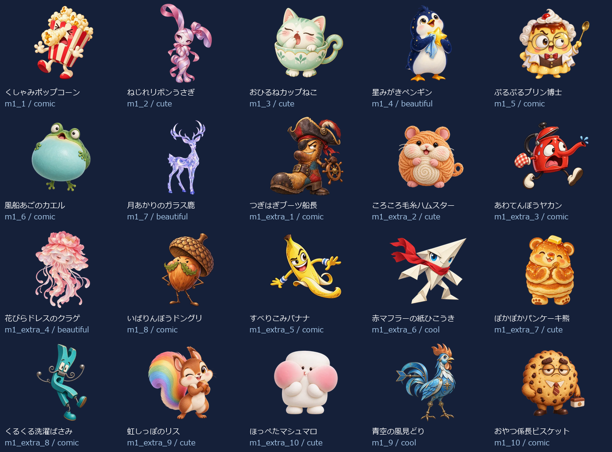
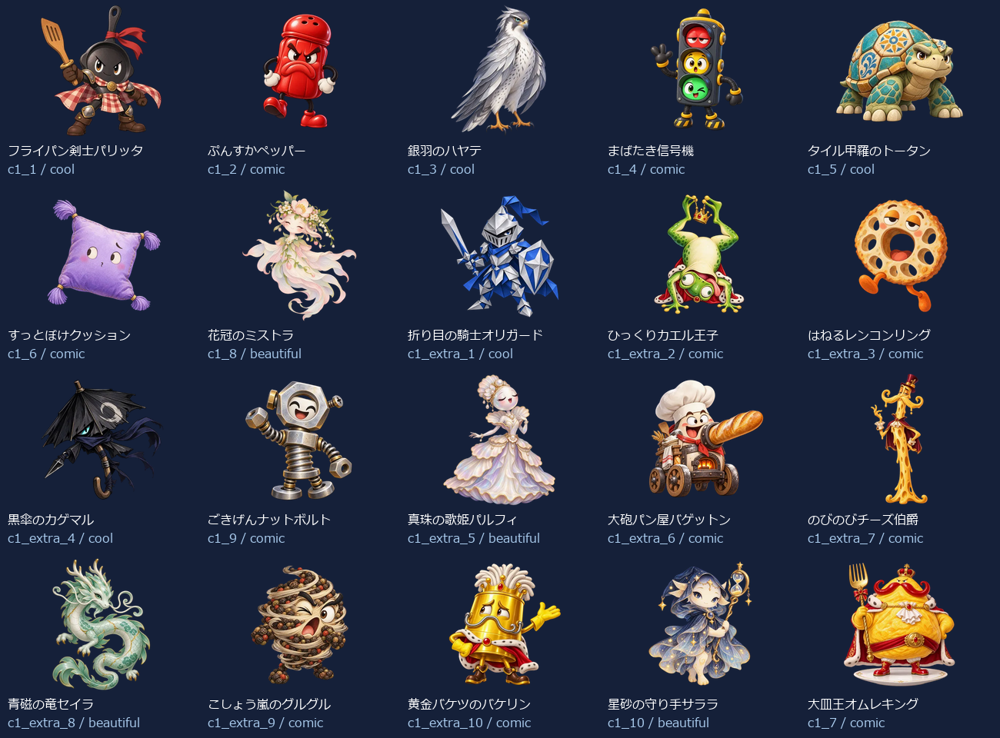
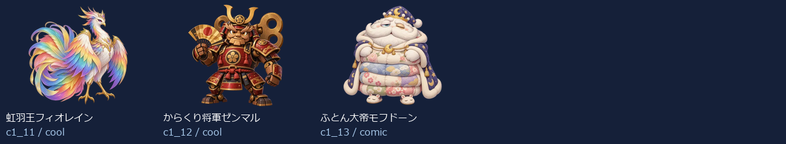

# Eiken4 Level 1：新名称・新画像43体（2026-10-05）

- 練習20＋バトル23（裏ボス3を含む）＝43キャラ。出題方法で倍に数えていません。
- 新しい名称に合わせてbuilt-in image_genで各キャラを個別制作。以前の4級以降の画像を改名して使っていません。
- 同じprofileから級＋既存IDで名前・タイプ・色・台詞・画像を取得。図鑑・トップ・戦闘・勝利・拡大へ反映。
- 既存ID・HP・登場順・撃破保存キーを維持。5級の名簿と画像は維持。
- 目・表情・体形・素材・画風を分散。最新指示の約4体に1体の大きく笑えるデザインを重点枠として制作。笑えるかどうかには個人差があります。

## 画像と読み込み

- 256px：43枚合計710.5KiB、平均16.5KiB。
- 384px：43枚合計1245.2KiB、平均29.0KiB。
- 1024px：43枚合計5988.0KiB、平均139.3KiB。
- 静止透過WebP、元画像を拡大せず変換。図鑑は遅延取得、戦闘は次の敵だけ先読み、高解像度は拡大した1体だけ取得。追加ライブラリなし。
- 旧画像を保全する別URLフォルダを使用し、古い画像キャッシュとの混同を防止。

## 修正一覧

| 区域・順 | ID | 旧名称 | 新名称 | デザインの方向 |
| --- | --- | --- | --- | --- |
| 練習 1 | m1_1 | 朝ねぼうベルクロック | くしゃみポップコーン | コミカル |
| 練習 2 | m1_2 | ちらかしノートミミック | ねじれリボンうさぎ | かわいい |
| 練習 3 | m1_3 | おしゃべりラッパバード | おひるねカップねこ | かわいい |
| 練習 4 | m1_4 | つまみぐいスナックオーク | 星みがきペンギン | きれい |
| 練習 5 | m1_5 | らくがきスターゴースト | ぷるぷるプリン博士 | コミカル |
| 練習 6 | m1_6 | まいごの消しゴムナイト | 風船あごのカエル | コミカル |
| 練習 7 | m1_7 | そうじサボりダストマスク | 月あかりのガラス鹿 | きれい |
| 練習 8 | m1_extra_1 | 朝チャイムスライム | つぎはぎブーツ船長 | コミカル |
| 練習 9 | m1_extra_2 | プリントつむじバード | ころころ毛糸ハムスター | かわいい |
| 練習 10 | m1_extra_3 | えんぴつ番人ゴーレム | あわてんぼうヤカン | コミカル |
| 練習 11 | m1_extra_4 | 給食列ならびオーク | 花びらドレスのクラゲ | きれい |
| 練習 12 | m1_8 | 給食おかわりキング | いばりんぼうドングリ | コミカル |
| 練習 13 | m1_extra_5 | 音読こだまゴースト | すべりこみバナナ | コミカル |
| 練習 14 | m1_extra_6 | 時間割ロボ | 赤マフラーの紙ひこうき | かっこいい |
| 練習 15 | m1_extra_7 | ノート整理スライム | ぽかぽかパンケーキ熊 | かわいい |
| 練習 16 | m1_extra_8 | 小テストフクロウ | くるくる洗濯ばさみ | コミカル |
| 練習 17 | m1_extra_9 | しおり守りミミック | 虹しっぽのリス | かわいい |
| 練習 18 | m1_extra_10 | 集中ほのおビースト | ほっぺたマシュマロ | かわいい |
| 練習 19 | m1_9 | としょかん禁書ミミック | 青空の風見どり | かっこいい |
| 練習 20 | m1_10 | ゲーム沼ドラゴン | おやつ係長ビスケット | コミカル |
| バトル 1 | c1_1 | 影ぬいインクコア | フライパン剣士パリッタ | かっこいい |
| バトル 2 | c1_2 | 炎門のケルベロス | ぷんすかペッパー | コミカル |
| バトル 3 | c1_3 | 嵐譜のウイングメイジ | 銀羽のハヤテ | かっこいい |
| バトル 4 | c1_4 | 呪面ファントム | まばたき信号機 | コミカル |
| バトル 5 | c1_5 | 鉄壁プロトガード | タイル甲羅のトータン | かっこいい |
| バトル 6 | c1_6 | 地鳴りルーンゴーレム | すっとぼけクッション | コミカル |
| バトル 7 | c1_8 | 紅牙ブラッドファング | 花冠のミストラ | きれい |
| バトル 8 | c1_extra_1 | 黒インクスライム改 | 折り目の騎士オリガード | かっこいい |
| バトル 9 | c1_extra_2 | 火花の番犬 | ひっくりカエル王子 | コミカル |
| バトル 10 | c1_extra_3 | 風読みウィング | はねるレンコンリング | コミカル |
| バトル 11 | c1_extra_4 | 仮面の影法師 | 黒傘のカゲマル | かっこいい |
| バトル 12 | c1_9 | 奈落ランタンレイス | ごきげんナットボルト | コミカル |
| バトル 13 | c1_extra_5 | 鉄壁ガード改 | 真珠の歌姫パルフィ | きれい |
| バトル 14 | c1_extra_6 | 石文ルーン像 | 大砲パン屋バゲットン | コミカル |
| バトル 15 | c1_extra_7 | 紅牙の追跡者 | のびのびチーズ伯爵 | コミカル |
| バトル 16 | c1_extra_8 | 奈落の灯火 | 青磁の竜セイラ | きれい |
| バトル 17 | c1_extra_9 | 獄炎の照準手 | こしょう嵐のグルグル | コミカル |
| バトル 18 | c1_extra_10 | 魔門の門番 | 黄金バケツのバケリン | コミカル |
| バトル 19 | c1_10 | 獄炎バリスタ・アイ | 星砂の守り手サララ | きれい |
| バトル 20 | c1_7 | 魔王ドラゴニス | 大皿王オムレキング | コミカル |
| バトル 21 | c1_11 | 裏魔竜ヴォイド | 虹羽王フィオレイン | かっこいい |
| バトル 22 | c1_12 | 深淵王ネメシス | からくり将軍ゼンマル | かっこいい |
| バトル 23 | c1_13 | 真冥皇アポカリス | ふとん大帝モフドーン | コミカル |

## 43体の見本

## 再確認

- `node scripts/test-monster-redesign.mjs`：共通名簿・ID・HP・保存キー、新名称と画像URL・実ファイルの対応。
- `python scripts/export-monster-redesign.py`：元画像ハッシュ、透過、サイズ、四辺、静止画像、拡大せず変換したこと。
- UI検査：実際の名前表示、図鑑43画像、トップ/戦闘/勝利/次の敵/練習、拡大/矢印/スワイプ、PC/スマホ幅、読み込み数、撃破記録保持。実機Pixel Tabletの確認は含みません。
- [個別制作プロンプト・画像ハッシュ・サイズ・台詞](./eiken4-level1.json)。
