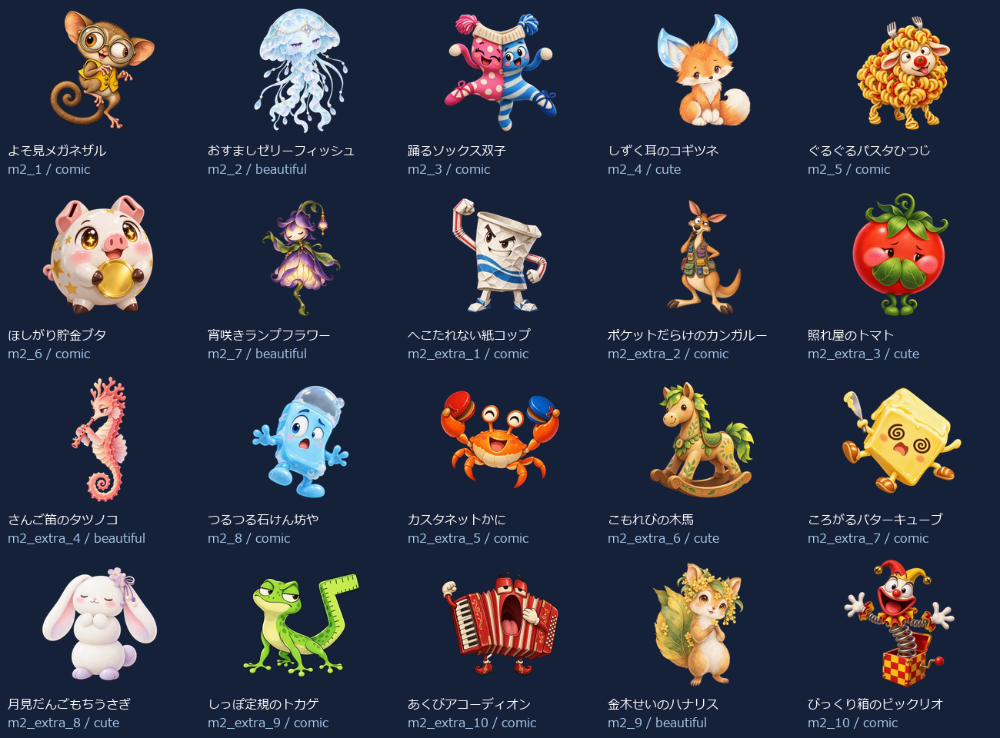
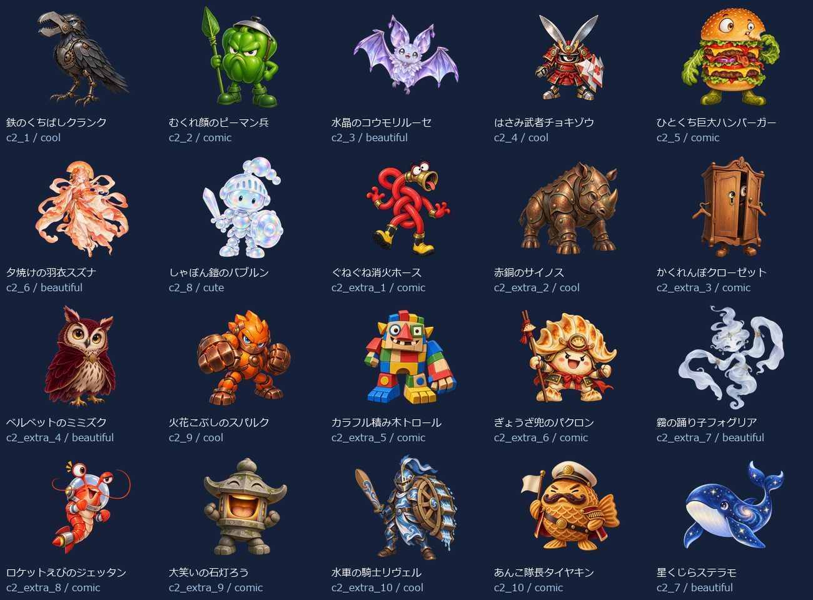
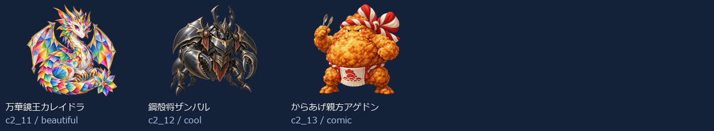

# Eiken4 Level 2：新名称・新画像43体（2026-10-05）

- 練習20＋バトル23（裏ボス3を含む）＝43キャラ。出題方法で倍に数えていません。
- 新しい名称に合わせてbuilt-in image_genで各キャラを個別制作。以前の4級以降の画像を改名して使っていません。
- 同じprofileから級＋既存IDで名前・タイプ・色・台詞・画像を取得。図鑑・トップ・戦闘・勝利・拡大へ反映。
- 既存ID・HP・登場順・撃破保存キーを維持。5級の名簿と画像は維持。
- 目・表情・体形・素材・画風を分散。最新指示の約4体に1体の大きく笑えるデザインを重点枠として制作。笑えるかどうかには個人差があります。

## 画像と読み込み

- 256px：43枚合計755.4KiB、平均17.6KiB。
- 384px：43枚合計1333.5KiB、平均31.0KiB。
- 1024px：43枚合計6459.5KiB、平均150.2KiB。
- 静止透過WebP、元画像を拡大せず変換。図鑑は遅延取得、戦闘は次の敵だけ先読み、高解像度は拡大した1体だけ取得。追加ライブラリなし。
- 旧画像を保全する別URLフォルダを使用し、古い画像キャッシュとの混同を防止。

## 修正一覧

| 区域・順 | ID | 旧名称 | 新名称 | デザインの方向 |
| --- | --- | --- | --- | --- |
| 練習 1 | m2_1 | 遅刻コウモリ | よそ見メガネザル | コミカル |
| 練習 2 | m2_2 | わすれんぼウルフ | おすましゼリーフィッシュ | きれい |
| 練習 3 | m2_3 | いじわるフォックス | 踊るソックス双子 | コミカル |
| 練習 4 | m2_4 | 居眠りベア | しずく耳のコギツネ | かわいい |
| 練習 5 | m2_5 | 黒板消しクリーチャー | ぐるぐるパスタひつじ | コミカル |
| 練習 6 | m2_6 | リコーダーへび | ほしがり貯金ブタ | コミカル |
| 練習 7 | m2_7 | ドッジボールゴーレム | 宵咲きランプフラワー | きれい |
| 練習 8 | m2_extra_1 | 朝礼コウモリ | へこたれない紙コップ | コミカル |
| 練習 9 | m2_extra_2 | 忘れ物チェックウルフ | ポケットだらけのカンガルー | コミカル |
| 練習 10 | m2_extra_3 | 仲直りフォックス | 照れ屋のトマト | かわいい |
| 練習 11 | m2_extra_4 | 目覚ましベア | さんご笛のタツノコ | きれい |
| 練習 12 | m2_8 | うわばき隠し | つるつる石けん坊や | コミカル |
| 練習 13 | m2_extra_5 | 黒板みがき精 | カスタネットかに | コミカル |
| 練習 14 | m2_extra_6 | 音階へび | こもれびの木馬 | かわいい |
| 練習 15 | m2_extra_7 | キャッチ練習ロボ | ころがるバターキューブ | コミカル |
| 練習 16 | m2_extra_8 | 上ばき番人 | 月見だんごもちうさぎ | かわいい |
| 練習 17 | m2_extra_9 | 静けさトロール | しっぽ定規のトカゲ | コミカル |
| 練習 18 | m2_extra_10 | テスト前スピリット | あくびアコーディオン | コミカル |
| 練習 19 | m2_9 | 騒音トロール | 金木せいのハナリス | きれい |
| 練習 20 | m2_10 | テストの悪魔 | びっくり箱のビックリオ | コミカル |
| バトル 1 | c2_1 | ポイズンスライム | 鉄のくちばしクランク | かっこいい |
| バトル 2 | c2_2 | 氷結のオオカミ | むくれ顔のピーマン兵 | コミカル |
| バトル 3 | c2_3 | サンダーバード | 水晶のコウモリルーセ | きれい |
| バトル 4 | c2_4 | ファントムナイト | はさみ武者チョキゾウ | かっこいい |
| バトル 5 | c2_5 | 古代兵器オメガ | ひとくち巨大ハンバーガー | コミカル |
| バトル 6 | c2_6 | デス・スコーピオン | 夕焼けの羽衣スズナ | きれい |
| バトル 7 | c2_8 | ブリザードミラー | しゃぼん鎧のバブルン | かわいい |
| バトル 8 | c2_extra_1 | 毒霧スライム | ぐねぐね消火ホース | コミカル |
| バトル 9 | c2_extra_2 | 氷牙ウルフ | 赤銅のサイノス | かっこいい |
| バトル 10 | c2_extra_3 | 雷羽バード | かくれんぼクローゼット | コミカル |
| バトル 11 | c2_extra_4 | 幻影ナイト | ベルベットのミミズク | きれい |
| バトル 12 | c2_9 | ナイトメアクロウ | 火花こぶしのスパルク | かっこいい |
| バトル 13 | c2_extra_5 | 古代ギア兵 | カラフル積み木トロール | コミカル |
| バトル 14 | c2_extra_6 | 砂毒スコーピオン | ぎょうざ兜のパクロン | コミカル |
| バトル 15 | c2_extra_7 | 氷鏡の番人 | 霧の踊り子フォグリア | きれい |
| バトル 16 | c2_extra_8 | 悪夢の羽音 | ロケットえびのジェッタン | コミカル |
| バトル 17 | c2_extra_9 | 深海の審判官 | 大笑いの石灯ろう | コミカル |
| バトル 18 | c2_extra_10 | 冥府の門衛 | 水車の騎士リヴェル | かっこいい |
| バトル 19 | c2_10 | 深海のジャッジ | あんこ隊長タイヤキン | コミカル |
| バトル 20 | c2_7 | 冥王ハーデス | 星くじらステラモ | きれい |
| バトル 21 | c2_11 | 裏冥王レヴナント | 万華鏡王カレイドラ | きれい |
| バトル 22 | c2_12 | 終刻神クロノス | 鋼殻将ザンバル | かっこいい |
| バトル 23 | c2_13 | 真絶望アザゼル | からあげ親方アゲドン | コミカル |

## 43体の見本

## 再確認

- `node scripts/test-monster-redesign.mjs`：共通名簿・ID・HP・保存キー、新名称と画像URL・実ファイルの対応。
- `python scripts/export-monster-redesign.py`：元画像ハッシュ、透過、サイズ、四辺、静止画像、拡大せず変換したこと。
- UI検査：実際の名前表示、図鑑43画像、トップ/戦闘/勝利/次の敵/練習、拡大/矢印/スワイプ、PC/スマホ幅、読み込み数、撃破記録保持。実機Pixel Tabletの確認は含みません。
- [個別制作プロンプト・画像ハッシュ・サイズ・台詞](./eiken4-level2.json)。
