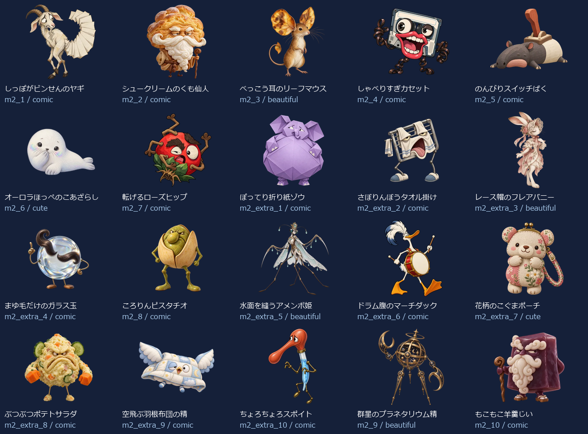
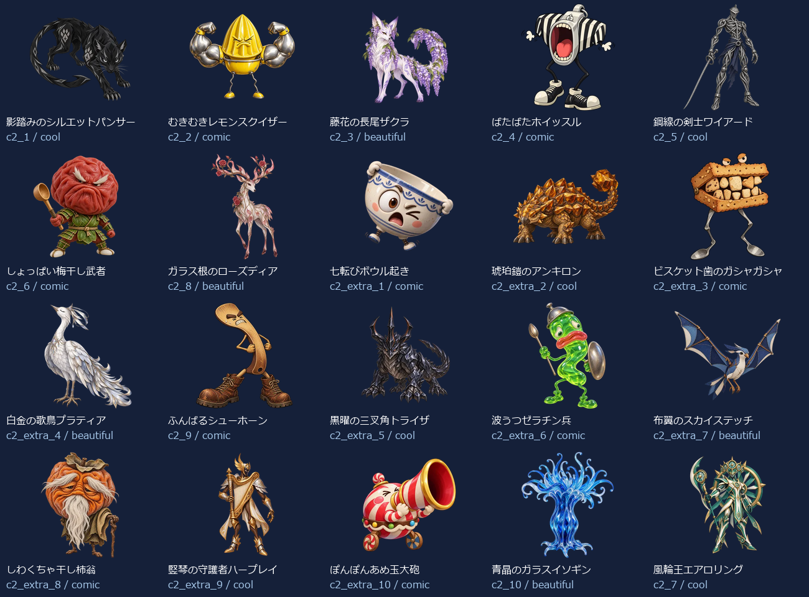
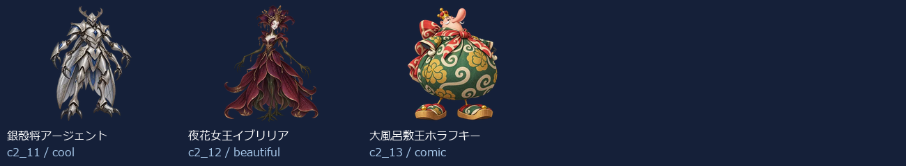

# EikenPre1Part1 Level 2：新名称・新画像43体（2026-10-05）

- 練習20＋バトル23（裏ボス3を含む）＝43キャラ。出題方法で倍に数えていません。
- 新しい名称に合わせてbuilt-in image_genで各キャラを個別制作。以前の4級以降の画像を改名して使っていません。
- 同じprofileから級＋既存IDで名前・タイプ・色・台詞・画像を取得。図鑑・トップ・戦闘・勝利・拡大へ反映。
- 既存ID・HP・登場順・撃破保存キーを維持。5級の名簿と画像は維持。
- 目・表情・体形・素材・画風を分散。設計方向はコミカル24体・かっこいい7体・かわいい2体・きれい10体。分類の件数は笑えることの保証ではなく、実際の見た印象を一覧で確認します。

## 画像と読み込み

- 256px：43枚合計706.7KiB、平均16.4KiB。
- 384px：43枚合計1255.6KiB、平均29.2KiB。
- 1024px：43枚合計6265.2KiB、平均145.7KiB。
- 静止透過WebP、元画像を拡大せず変換。図鑑は遅延取得、戦闘は次の敵の通常画像だけ先読み、高解像度は拡大表示または登場・撃破する現在の1体だけ取得。追加ライブラリなし。
- 旧画像を保全する別URLフォルダを使用し、古い画像キャッシュとの混同を防止。

## 修正一覧

| 区域・順 | ID | 旧名称 | 新名称 | デザインの方向 |
| --- | --- | --- | --- | --- |
| 練習 1 | m2_1 | 遅刻コウモリ | しっぽがビンせんのヤギ | コミカル |
| 練習 2 | m2_2 | わすれんぼウルフ | シュークリームのくも仙人 | コミカル |
| 練習 3 | m2_3 | いじわるフォックス | べっこう耳のリーフマウス | きれい |
| 練習 4 | m2_4 | 居眠りベア | しゃべりすぎカセット | コミカル |
| 練習 5 | m2_5 | 黒板消しクリーチャー | のんびりスイッチばく | コミカル |
| 練習 6 | m2_6 | リコーダーへび | オーロラほっぺのこあざらし | かわいい |
| 練習 7 | m2_7 | ドッジボールゴーレム | 転げるローズヒップ | コミカル |
| 練習 8 | m2_extra_1 | 朝礼コウモリ | ぽってり折り紙ゾウ | コミカル |
| 練習 9 | m2_extra_2 | 忘れ物チェックウルフ | さぼりんぼうタオル掛け | コミカル |
| 練習 10 | m2_extra_3 | 仲直りフォックス | レース帽のフレアバニー | きれい |
| 練習 11 | m2_extra_4 | 目覚ましベア | まゆ毛だけのガラス玉 | コミカル |
| 練習 12 | m2_8 | うわばき隠し | ころりんピスタチオ | コミカル |
| 練習 13 | m2_extra_5 | 黒板みがき精 | 水面を縫うアメンボ姫 | きれい |
| 練習 14 | m2_extra_6 | 音階へび | ドラム腹のマーチダック | コミカル |
| 練習 15 | m2_extra_7 | キャッチ練習ロボ | 花柄のこぐまポーチ | かわいい |
| 練習 16 | m2_extra_8 | 上ばき番人 | ぶつぶつポテトサラダ | コミカル |
| 練習 17 | m2_extra_9 | 静けさトロール | 空飛ぶ羽根布団の精 | コミカル |
| 練習 18 | m2_extra_10 | テスト前スピリット | ちょろちょろスポイト | コミカル |
| 練習 19 | m2_9 | 騒音トロール | 群星のプラネタリウム精 | きれい |
| 練習 20 | m2_10 | テストの悪魔 | もこもこ羊羹じい | コミカル |
| バトル 1 | c2_1 | ポイズンスライム | 影踏みのシルエットパンサー | かっこいい |
| バトル 2 | c2_2 | 氷結のオオカミ | むきむきレモンスクイザー | コミカル |
| バトル 3 | c2_3 | サンダーバード | 藤花の長尾ザクラ | きれい |
| バトル 4 | c2_4 | ファントムナイト | ばたばたホイッスル | コミカル |
| バトル 5 | c2_5 | 古代兵器オメガ | 鋼線の剣士ワイアード | かっこいい |
| バトル 6 | c2_6 | デス・スコーピオン | しょっぱい梅干し武者 | コミカル |
| バトル 7 | c2_8 | ブリザードミラー | ガラス根のローズディア | きれい |
| バトル 8 | c2_extra_1 | 毒霧スライム | 七転びボウル起き | コミカル |
| バトル 9 | c2_extra_2 | 氷牙ウルフ | 琥珀鎧のアンキロン | かっこいい |
| バトル 10 | c2_extra_3 | 雷羽バード | ビスケット歯のガシャガシャ | コミカル |
| バトル 11 | c2_extra_4 | 幻影ナイト | 白金の歌鳥プラティア | きれい |
| バトル 12 | c2_9 | ナイトメアクロウ | ふんばるシューホーン | コミカル |
| バトル 13 | c2_extra_5 | 古代ギア兵 | 黒曜の三叉角トライザ | かっこいい |
| バトル 14 | c2_extra_6 | 砂毒スコーピオン | 波うつゼラチン兵 | コミカル |
| バトル 15 | c2_extra_7 | 氷鏡の番人 | 布翼のスカイステッチ | きれい |
| バトル 16 | c2_extra_8 | 悪夢の羽音 | しわくちゃ干し柿翁 | コミカル |
| バトル 17 | c2_extra_9 | 深海の審判官 | 竪琴の守護者ハープレイ | かっこいい |
| バトル 18 | c2_extra_10 | 冥府の門衛 | ぽんぽんあめ玉大砲 | コミカル |
| バトル 19 | c2_10 | 深海のジャッジ | 青晶のガラスイソギン | きれい |
| バトル 20 | c2_7 | 冥王ハーデス | 風輪王エアロリング | かっこいい |
| バトル 21 | c2_11 | 裏冥王レヴナント | 銀殻将アージェント | かっこいい |
| バトル 22 | c2_12 | 終刻神クロノス | 夜花女王イブリリア | きれい |
| バトル 23 | c2_13 | 真絶望アザゼル | 大風呂敷王ホラフキー | コミカル |

## 43体の見本

## 再確認

- `node scripts/test-monster-redesign.mjs`：共通名簿・ID・HP・保存キー、新名称と画像URL・実ファイルの対応。
- `python scripts/export-monster-redesign.py`：元画像ハッシュ、透過、サイズ、四辺、静止画像、拡大せず変換したこと。
- UI検査：実際の名前表示、図鑑43画像、トップ/戦闘/勝利/次の敵/練習、拡大/矢印/スワイプ、PC/スマホ幅、読み込み数、撃破記録保持。実機Pixel Tabletの確認は含みません。
- [個別制作プロンプト・画像ハッシュ・サイズ・台詞](./eikenpre1part1-level2.json)。
