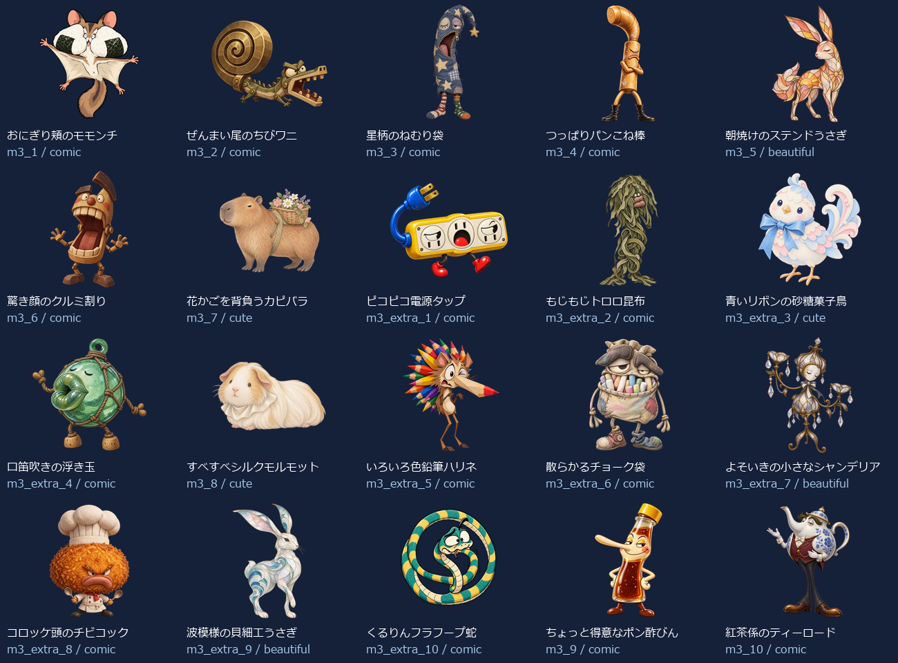
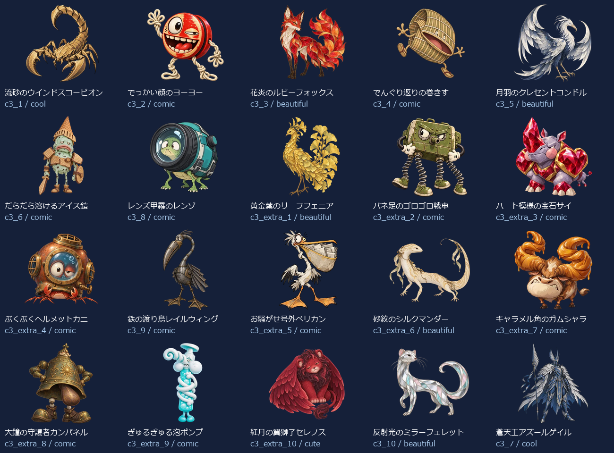
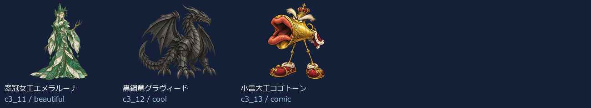

# EikenPre1Part1 Level 3：新名称・新画像43体（2026-10-07）

- 練習20＋バトル23（裏ボス3を含む）＝43キャラ。出題方法で倍に数えていません。
- 新しい名称に合わせてbuilt-in image_genで各キャラを個別制作。以前の4級以降の画像を改名して使っていません。
- 同じprofileから級＋既存IDで名前・タイプ・色・台詞・画像を取得。図鑑・トップ・戦闘・勝利・拡大へ反映。
- 既存ID・HP・登場順・撃破保存キーを維持。5級の名簿と画像は維持。
- 目・表情・体形・素材・画風を分散。設計方向はコミカル27体・かっこいい3体・かわいい4体・きれい9体。分類の件数は笑えることの保証ではなく、実際の見た印象を一覧で確認します。

## 画像と読み込み

- 256px：43枚合計756.1KiB、平均17.6KiB。
- 384px：43枚合計1347.6KiB、平均31.3KiB。
- 1024px：43枚合計6977.6KiB、平均162.3KiB。
- 静止透過WebP、元画像を拡大せず変換。図鑑は遅延取得、戦闘は次の敵の通常画像だけ先読み、高解像度は拡大表示または登場・撃破する現在の1体だけ取得。追加ライブラリなし。
- 旧画像を保全する別URLフォルダを使用し、古い画像キャッシュとの混同を防止。

## 修正一覧

| 区域・順 | ID | 旧名称 | 新名称 | デザインの方向 |
| --- | --- | --- | --- | --- |
| 練習 1 | m3_1 | 言い訳ゴースト | おにぎり頬のモモンチ | コミカル |
| 練習 2 | m3_2 | よそみロボ | ぜんまい尾のちびワニ | コミカル |
| 練習 3 | m3_3 | 夜更かしフクロウ | 星柄のねむり袋 | コミカル |
| 練習 4 | m3_4 | 廊下ダッシュチーター | つっぱりパンこね棒 | コミカル |
| 練習 5 | m3_5 | なまけゴーレム | 朝焼けのステンドうさぎ | きれい |
| 練習 6 | m3_6 | 偏食モンスター | 驚き顔のクルミ割り | コミカル |
| 練習 7 | m3_7 | 迷路マンション | 花かごを背負うカピバラ | かわいい |
| 練習 8 | m3_extra_1 | 正直ゴースト | ピコピコ電源タップ | コミカル |
| 練習 9 | m3_extra_2 | 集中ロボ改 | もじもじトロロ昆布 | コミカル |
| 練習 10 | m3_extra_3 | 早寝フクロウ | 青いリボンの砂糖菓子鳥 | かわいい |
| 練習 11 | m3_extra_4 | 廊下ストッパー | 口笛吹きの浮き玉 | コミカル |
| 練習 12 | m3_8 | 雷おやじ | すべすべシルクモルモット | かわいい |
| 練習 13 | m3_extra_5 | 運動ゴーレム | いろいろ色鉛筆ハリネ | コミカル |
| 練習 14 | m3_extra_6 | 野菜スライム | 散らかるチョーク袋 | コミカル |
| 練習 15 | m3_extra_7 | 出口案内ミミック | よそいきの小さなシャンデリア | きれい |
| 練習 16 | m3_extra_8 | 雷雲ゴースト | コロッケ頭のチビコック | コミカル |
| 練習 17 | m3_extra_9 | 宿題衛星コア | 波模様の貝細工うさぎ | きれい |
| 練習 18 | m3_extra_10 | 提出日ガーディアン | くるりんフラフープ蛇 | コミカル |
| 練習 19 | m3_9 | 宿題ブラックホール | ちょっと得意なポン酢びん | コミカル |
| 練習 20 | m3_10 | 夏休みの宿題王 | 紅茶係のティーロード | コミカル |
| バトル 1 | c3_1 | カオススライム | 流砂のウインドスコーピオン | かっこいい |
| バトル 2 | c3_2 | キメラビースト | でっかい顔のヨーヨー | コミカル |
| バトル 3 | c3_3 | ヴォイドウィング | 花炎のルビーフォックス | きれい |
| バトル 4 | c3_4 | スペクターロード | でんぐり返りの巻きす | コミカル |
| バトル 5 | c3_5 | 機神タイタン | 月羽のクレセントコンドル | きれい |
| バトル 6 | c3_6 | アビス・ウォーカー | だらだら溶けるアイス鎧 | コミカル |
| バトル 7 | c3_8 | 断罪のセラフ | レンズ甲羅のレンゾー | コミカル |
| バトル 8 | c3_extra_1 | 混沌スライム改 | 黄金葉のリーフフェニア | きれい |
| バトル 9 | c3_extra_2 | 金角キメラ | バネ足のゴロゴロ戦車 | コミカル |
| バトル 10 | c3_extra_3 | 夜空ウィング | ハート模様の宝石サイ | コミカル |
| バトル 11 | c3_extra_4 | 白影ロード | ぶくぶくヘルメットカニ | コミカル |
| バトル 12 | c3_9 | 虚無のコロッサス | 鉄の渡り鳥レイルウィング | コミカル |
| バトル 13 | c3_extra_5 | 機神ガード | お騒がせ号外ペリカン | コミカル |
| バトル 14 | c3_extra_6 | 深淵ウォーカー改 | 砂紋のシルクマンダー | きれい |
| バトル 15 | c3_extra_7 | 裁きの羽 | キャラメル角のガムシャラ | コミカル |
| バトル 16 | c3_extra_8 | 虚無巨像の影 | 大鐘の守護者カンパネル | コミカル |
| バトル 17 | c3_extra_9 | 深紅キマイラ改 | ぎゅるぎゅる泡ポンプ | コミカル |
| バトル 18 | c3_extra_10 | 終焉門の番人 | 紅月の翼獅子セレノス | かわいい |
| バトル 19 | c3_10 | 深紅のキマイラ | 反射光のミラーフェレット | きれい |
| バトル 20 | c3_7 | 終焉のドラゴン | 蒼天王アズールゲイル | かっこいい |
| バトル 21 | c3_11 | 裏終焉ネビュラス | 翠冠女王エメラルーナ | きれい |
| バトル 22 | c3_12 | 深黒皇ディザスター | 黒鋼竜グラヴィード | かっこいい |
| バトル 23 | c3_13 | 真終王アポカリプス | 小言大王コゴトーン | コミカル |

## 本人の好みを反映した仕上げ調整

「シャレが効いていて、イラストとしてもクオリティが高い」という希望と6体の実例を基準に、平板な仕上げに寄っていた次の6体を調整しました。表情・体形・発想を保ち、材質と立体感を整えています。旧原画もローカル制作資料に保全しています。

| 名称 | 仕上げ調整 |
| --- | --- |
| つっぱりパンこね棒 | 木目、丸い木の厚み、小麦粉の跡、革靴の質感 |
| ピコピコ電源タップ | 樹脂の厚みとネジ、真鍮の端子、ゴムコードの陰影 |
| でっかい顔のヨーヨー | 木目と赤い塗装、編みひもの立体感 |
| ちょっと得意なポン酢びん | 厚いガラス、琥珀色の液体と柑橘の粒、反射 |
| バネ足のゴロゴロ戦車 | 塗装の傷、鋼のコイル、手袋とゴムの材質 |
| ハート模様の宝石サイ | ルビーの内部反射、石肌、細工の光と厚み |

発想のバラエティと描き込みを両立し、かっこいい系は43体中3体にしています。分類だけで面白さを保証していません。個々の修正理由・元画像と採用画像のハッシュ・修正プロンプトは下記JSONの `revisions` に記録しています。

## 43体の見本

## 再確認

- `node scripts/test-monster-redesign.mjs`：共通名簿・ID・HP・保存キー、新名称と画像URL・実ファイルの対応。
- `python scripts/export-monster-redesign.py`：元画像ハッシュ、透過、サイズ、四辺、静止画像、拡大せず変換したこと。
- UI検査：実際の名前表示、図鑑43画像、トップ/戦闘/勝利/次の敵/練習、拡大/矢印/スワイプ、PC/スマホ幅、読み込み数、撃破記録保持。実機Pixel Tabletの確認は含みません。
- [個別制作プロンプト・画像ハッシュ・サイズ・台詞](./eikenpre1part1-level3.json)。
