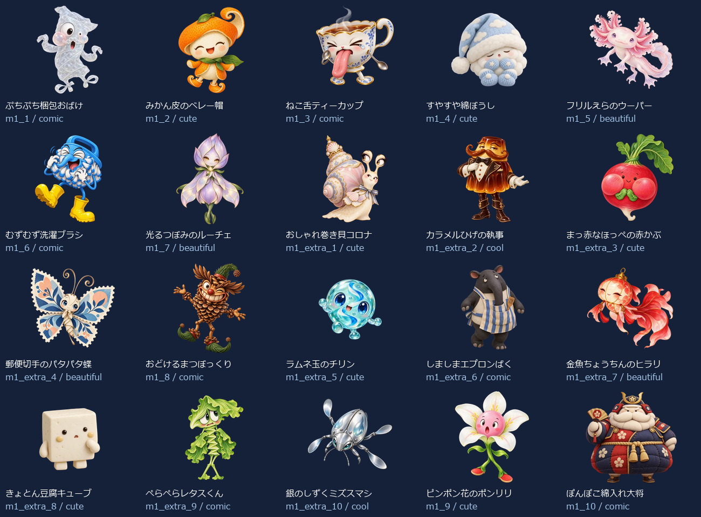
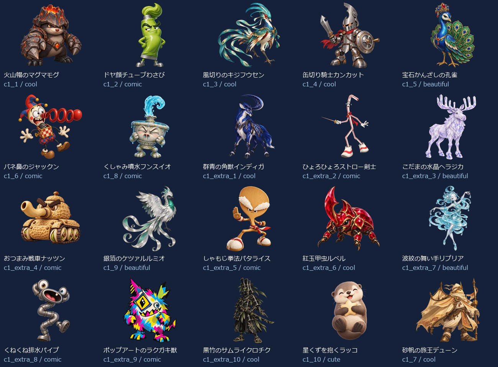
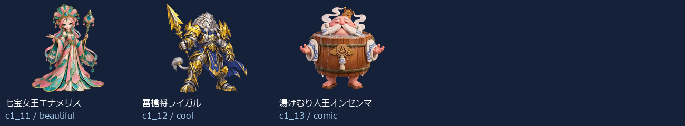

# EikenPre2 Level 1：新名称・新画像43体（2026-10-05）

- 練習20＋バトル23（裏ボス3を含む）＝43キャラ。出題方法で倍に数えていません。
- 新しい名称に合わせてbuilt-in image_genで各キャラを個別制作。以前の4級以降の画像を改名して使っていません。
- 同じprofileから級＋既存IDで名前・タイプ・色・台詞・画像を取得。図鑑・トップ・戦闘・勝利・拡大へ反映。
- 既存ID・HP・登場順・撃破保存キーを維持。5級の名簿と画像は維持。
- 目・表情・体形・素材・画風を分散。最新指示の約4体に1体の大きく笑えるデザインを重点枠として制作。笑えるかどうかには個人差があります。

## 画像と読み込み

- 256px：43枚合計752.4KiB、平均17.5KiB。
- 384px：43枚合計1325.0KiB、平均30.8KiB。
- 1024px：43枚合計6462.2KiB、平均150.3KiB。
- 静止透過WebP、元画像を拡大せず変換。図鑑は遅延取得、戦闘は次の敵の通常画像だけ先読み、高解像度は拡大表示または登場・撃破する現在の1体だけ取得。追加ライブラリなし。
- 旧画像を保全する別URLフォルダを使用し、古い画像キャッシュとの混同を防止。

## 修正一覧

| 区域・順 | ID | 旧名称 | 新名称 | デザインの方向 |
| --- | --- | --- | --- | --- |
| 練習 1 | m1_1 | 朝ねぼうベルクロック | ぷちぷち梱包おばけ | コミカル |
| 練習 2 | m1_2 | ちらかしノートミミック | みかん皮のベレー帽 | かわいい |
| 練習 3 | m1_3 | おしゃべりラッパバード | ねこ舌ティーカップ | コミカル |
| 練習 4 | m1_4 | つまみぐいスナックオーク | すやすや綿ぼうし | かわいい |
| 練習 5 | m1_5 | らくがきスターゴースト | フリルえらのウーパー | きれい |
| 練習 6 | m1_6 | まいごの消しゴムナイト | むずむず洗濯ブラシ | コミカル |
| 練習 7 | m1_7 | そうじサボりダストマスク | 光るつぼみのルーチェ | きれい |
| 練習 8 | m1_extra_1 | 朝チャイムスライム | おしゃれ巻き貝コロナ | かわいい |
| 練習 9 | m1_extra_2 | プリントつむじバード | カラメルひげの執事 | かっこいい |
| 練習 10 | m1_extra_3 | えんぴつ番人ゴーレム | まっ赤なほっぺの赤かぶ | かわいい |
| 練習 11 | m1_extra_4 | 給食列ならびオーク | 郵便切手のパタパタ蝶 | きれい |
| 練習 12 | m1_8 | 給食おかわりキング | おどけるまつぼっくり | コミカル |
| 練習 13 | m1_extra_5 | 音読こだまゴースト | ラムネ玉のチリン | かわいい |
| 練習 14 | m1_extra_6 | 時間割ロボ | しましまエプロンばく | コミカル |
| 練習 15 | m1_extra_7 | ノート整理スライム | 金魚ちょうちんのヒラリ | きれい |
| 練習 16 | m1_extra_8 | 小テストフクロウ | きょとん豆腐キューブ | かわいい |
| 練習 17 | m1_extra_9 | しおり守りミミック | ぺらぺらレタスくん | コミカル |
| 練習 18 | m1_extra_10 | 集中ほのおビースト | 銀のしずくミズスマシ | かっこいい |
| 練習 19 | m1_9 | としょかん禁書ミミック | ピンポン花のポンリリ | かわいい |
| 練習 20 | m1_10 | ゲーム沼ドラゴン | ぽんぽこ綿入れ大将 | コミカル |
| バトル 1 | c1_1 | 影ぬいインクコア | 火山帽のマグマモグ | かっこいい |
| バトル 2 | c1_2 | 炎門のケルベロス | ドヤ顔チューブわさび | コミカル |
| バトル 3 | c1_3 | 嵐譜のウイングメイジ | 風切りのキジフウセン | かっこいい |
| バトル 4 | c1_4 | 呪面ファントム | 缶切り騎士カンカット | かっこいい |
| バトル 5 | c1_5 | 鉄壁プロトガード | 宝石かんざしの孔雀 | きれい |
| バトル 6 | c1_6 | 地鳴りルーンゴーレム | バネ鼻のジャックン | コミカル |
| バトル 7 | c1_8 | 紅牙ブラッドファング | くしゃみ噴水フンスイオ | コミカル |
| バトル 8 | c1_extra_1 | 黒インクスライム改 | 群青の角獣インディガ | かっこいい |
| バトル 9 | c1_extra_2 | 火花の番犬 | ひょろひょろストロー剣士 | コミカル |
| バトル 10 | c1_extra_3 | 風読みウィング | こだまの水晶ヘラジカ | きれい |
| バトル 11 | c1_extra_4 | 仮面の影法師 | おつまみ戦車ナッツン | コミカル |
| バトル 12 | c1_9 | 奈落ランタンレイス | 銀箔のケツァルルミオ | きれい |
| バトル 13 | c1_extra_5 | 鉄壁ガード改 | しゃもじ拳法パタライス | コミカル |
| バトル 14 | c1_extra_6 | 石文ルーン像 | 紅玉甲虫ルベル | かっこいい |
| バトル 15 | c1_extra_7 | 紅牙の追跡者 | 波紋の舞い手リプリア | きれい |
| バトル 16 | c1_extra_8 | 奈落の灯火 | くねくね排水パイプ | コミカル |
| バトル 17 | c1_extra_9 | 獄炎の照準手 | ポップアートのラクガキ獣 | コミカル |
| バトル 18 | c1_extra_10 | 魔門の門番 | 黒竹のサムライクロチク | かっこいい |
| バトル 19 | c1_10 | 獄炎バリスタ・アイ | 星くずを抱くラッコ | かわいい |
| バトル 20 | c1_7 | 魔王ドラゴニス | 砂帆の旅王デューン | かっこいい |
| バトル 21 | c1_11 | 裏魔竜ヴォイド | 七宝女王エナメリス | きれい |
| バトル 22 | c1_12 | 深淵王ネメシス | 雷槍将ライガル | かっこいい |
| バトル 23 | c1_13 | 真冥皇アポカリス | 湯けむり大王オンセンマ | コミカル |

## 43体の見本

## 再確認

- `node scripts/test-monster-redesign.mjs`：共通名簿・ID・HP・保存キー、新名称と画像URL・実ファイルの対応。
- `python scripts/export-monster-redesign.py`：元画像ハッシュ、透過、サイズ、四辺、静止画像、拡大せず変換したこと。
- UI検査：実際の名前表示、図鑑43画像、トップ/戦闘/勝利/次の敵/練習、拡大/矢印/スワイプ、PC/スマホ幅、読み込み数、撃破記録保持。実機Pixel Tabletの確認は含みません。
- [個別制作プロンプト・画像ハッシュ・サイズ・台詞](./eikenpre2-level1.json)。
