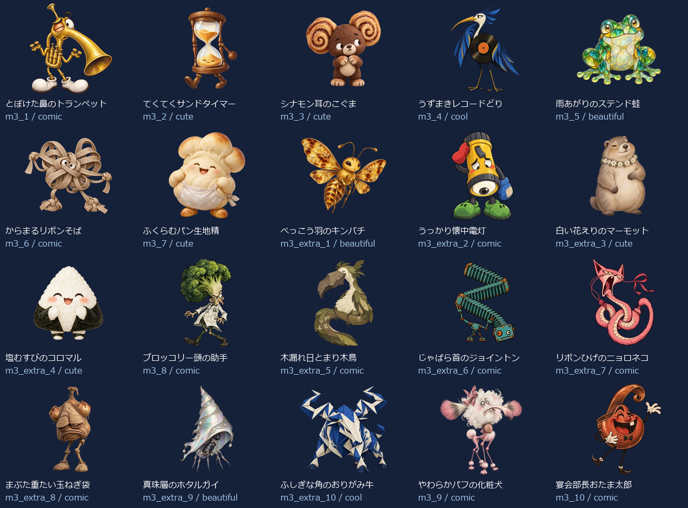
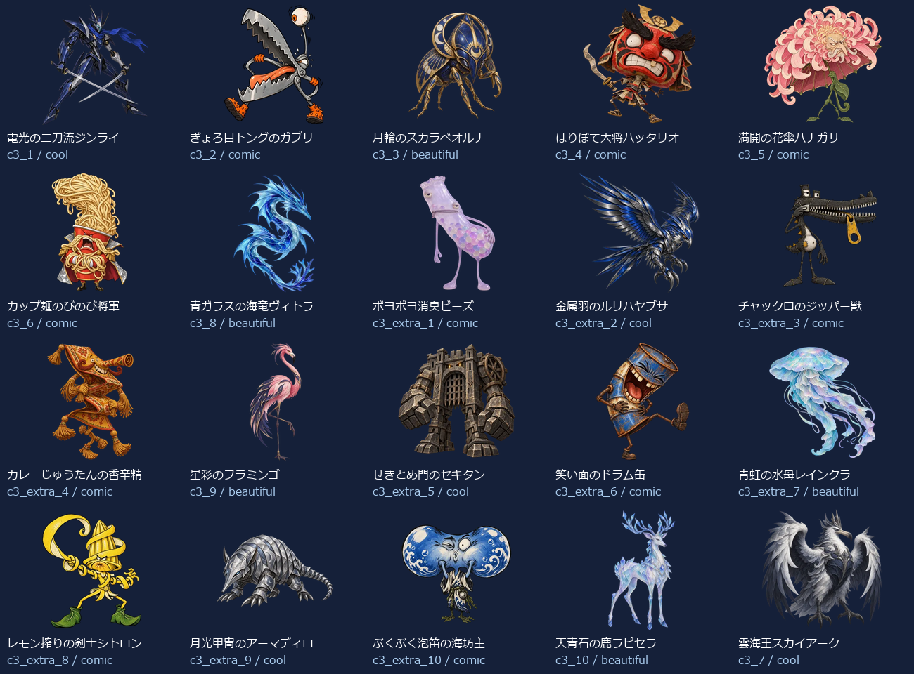
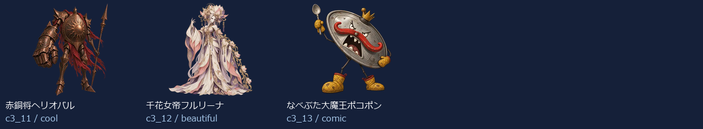

# EikenPre2 Level 3：新名称・新画像43体（2026-10-05）

- 練習20＋バトル23（裏ボス3を含む）＝43キャラ。出題方法で倍に数えていません。
- 新しい名称に合わせてbuilt-in image_genで各キャラを個別制作。以前の4級以降の画像を改名して使っていません。
- 同じprofileから級＋既存IDで名前・タイプ・色・台詞・画像を取得。図鑑・トップ・戦闘・勝利・拡大へ反映。
- 既存ID・HP・登場順・撃破保存キーを維持。5級の名簿と画像は維持。
- 目・表情・体形・素材・画風を分散。設計方向はコミカル21体・かっこいい8体・かわいい5体・きれい9体。分類の件数は笑えることの保証ではなく、実際の見た印象を一覧で確認します。

## 画像と読み込み

- 256px：43枚合計776.9KiB、平均18.1KiB。
- 384px：43枚合計1400.4KiB、平均32.6KiB。
- 1024px：43枚合計7217.0KiB、平均167.8KiB。
- 静止透過WebP、元画像を拡大せず変換。図鑑は遅延取得、戦闘は次の敵の通常画像だけ先読み、高解像度は拡大表示または登場・撃破する現在の1体だけ取得。追加ライブラリなし。
- 旧画像を保全する別URLフォルダを使用し、古い画像キャッシュとの混同を防止。

## 修正一覧

| 区域・順 | ID | 旧名称 | 新名称 | デザインの方向 |
| --- | --- | --- | --- | --- |
| 練習 1 | m3_1 | 言い訳ゴースト | とぼけた鼻のトランペット | コミカル |
| 練習 2 | m3_2 | よそみロボ | てくてくサンドタイマー | かわいい |
| 練習 3 | m3_3 | 夜更かしフクロウ | シナモン耳のこぐま | かわいい |
| 練習 4 | m3_4 | 廊下ダッシュチーター | うずまきレコードどり | かっこいい |
| 練習 5 | m3_5 | なまけゴーレム | 雨あがりのステンド蛙 | きれい |
| 練習 6 | m3_6 | 偏食モンスター | からまるリボンそば | コミカル |
| 練習 7 | m3_7 | 迷路マンション | ふくらむパン生地精 | かわいい |
| 練習 8 | m3_extra_1 | 正直ゴースト | べっこう羽のキンバチ | きれい |
| 練習 9 | m3_extra_2 | 集中ロボ改 | うっかり懐中電灯 | コミカル |
| 練習 10 | m3_extra_3 | 早寝フクロウ | 白い花えりのマーモット | かわいい |
| 練習 11 | m3_extra_4 | 廊下ストッパー | 塩むすびのコロマル | かわいい |
| 練習 12 | m3_8 | 雷おやじ | ブロッコリー頭の助手 | コミカル |
| 練習 13 | m3_extra_5 | 運動ゴーレム | 木漏れ日とまり木鳥 | コミカル |
| 練習 14 | m3_extra_6 | 野菜スライム | じゃばら首のジョイントン | コミカル |
| 練習 15 | m3_extra_7 | 出口案内ミミック | リボンひげのニョロネコ | コミカル |
| 練習 16 | m3_extra_8 | 雷雲ゴースト | まぶた重たい玉ねぎ袋 | コミカル |
| 練習 17 | m3_extra_9 | 宿題衛星コア | 真珠層のホタルガイ | きれい |
| 練習 18 | m3_extra_10 | 提出日ガーディアン | ふしぎな角のおりがみ牛 | かっこいい |
| 練習 19 | m3_9 | 宿題ブラックホール | やわらかパフの化粧犬 | コミカル |
| 練習 20 | m3_10 | 夏休みの宿題王 | 宴会部長おたま太郎 | コミカル |
| バトル 1 | c3_1 | カオススライム | 電光の二刀流ジンライ | かっこいい |
| バトル 2 | c3_2 | キメラビースト | ぎょろ目トングのガブリ | コミカル |
| バトル 3 | c3_3 | ヴォイドウィング | 月輪のスカラベオルナ | きれい |
| バトル 4 | c3_4 | スペクターロード | はりぼて大将ハッタリオ | コミカル |
| バトル 5 | c3_5 | 機神タイタン | 満開の花傘ハナガサ | コミカル |
| バトル 6 | c3_6 | アビス・ウォーカー | カップ麺のびのび将軍 | コミカル |
| バトル 7 | c3_8 | 断罪のセラフ | 青ガラスの海竜ヴィトラ | きれい |
| バトル 8 | c3_extra_1 | 混沌スライム改 | ボヨボヨ消臭ビーズ | コミカル |
| バトル 9 | c3_extra_2 | 金角キメラ | 金属羽のルリハヤブサ | かっこいい |
| バトル 10 | c3_extra_3 | 夜空ウィング | チャック口のジッパー獣 | コミカル |
| バトル 11 | c3_extra_4 | 白影ロード | カレーじゅうたんの香辛精 | コミカル |
| バトル 12 | c3_9 | 虚無のコロッサス | 星彩のフラミンゴ | きれい |
| バトル 13 | c3_extra_5 | 機神ガード | せきとめ門のセキタン | かっこいい |
| バトル 14 | c3_extra_6 | 深淵ウォーカー改 | 笑い面のドラム缶 | コミカル |
| バトル 15 | c3_extra_7 | 裁きの羽 | 青虹の水母レインクラ | きれい |
| バトル 16 | c3_extra_8 | 虚無巨像の影 | レモン搾りの剣士シトロン | コミカル |
| バトル 17 | c3_extra_9 | 深紅キマイラ改 | 月光甲冑のアーマディロ | かっこいい |
| バトル 18 | c3_extra_10 | 終焉門の番人 | ぶくぶく泡笛の海坊主 | コミカル |
| バトル 19 | c3_10 | 深紅のキマイラ | 天青石の鹿ラピセラ | きれい |
| バトル 20 | c3_7 | 終焉のドラゴン | 雲海王スカイアーク | かっこいい |
| バトル 21 | c3_11 | 裏終焉ネビュラス | 赤銅将ヘリオバル | かっこいい |
| バトル 22 | c3_12 | 深黒皇ディザスター | 千花女帝フルリーナ | きれい |
| バトル 23 | c3_13 | 真終王アポカリプス | なべぶた大魔王ポコポン | コミカル |

## 43体の見本

## 再確認

- `node scripts/test-monster-redesign.mjs`：共通名簿・ID・HP・保存キー、新名称と画像URL・実ファイルの対応。
- `python scripts/export-monster-redesign.py`：元画像ハッシュ、透過、サイズ、四辺、静止画像、拡大せず変換したこと。
- UI検査：実際の名前表示、図鑑43画像、トップ/戦闘/勝利/次の敵/練習、拡大/矢印/スワイプ、PC/スマホ幅、読み込み数、撃破記録保持。実機Pixel Tabletの確認は含みません。
- [個別制作プロンプト・画像ハッシュ・サイズ・台詞](./eikenpre2-level3.json)。
